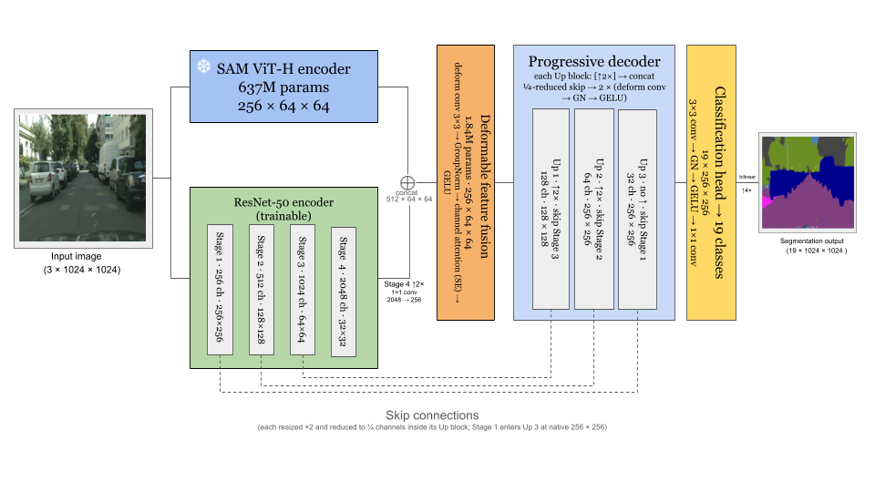

# AD-SAM

**Frozen Segment Anything features + a trainable CNN branch for driving-scene semantic segmentation.**

AD-SAM pairs SAM's frozen ViT-H image encoder with a trainable ResNet-50, fuses the two feature streams at 64×64 with a modulated deformable convolution and channel attention, and decodes to stride 4 through three deformable blocks with ResNet skip connections. Only 27M of its 664M parameters are trained. Because the SAM encoder never changes, its embeddings are computed once per image and cached, so a full 100-epoch Cityscapes run takes about a day on one GPU.

Paper: *AD-SAM: Fine-Tuning the Segment Anything Vision Foundation Model for Autonomous Driving Perception*, Camarena, Patel, Nazari, Papalexakis, Noruzoliaee, Chen. [arXiv:2510.27047](https://arxiv.org/abs/2510.27047)



## How it works

| Stage | What happens | Shape out |
|---|---|---|
| Input | RGB frame resized to 1024×1024, ImageNet-normalised | 3 × 1024 × 1024 |
| SAM ViT-H encoder (frozen) | 32 transformer blocks; input re-normalised to SAM's statistics inside the model. Embeddings are pre-computed once per image (plus a flipped copy) | 256 × 64 × 64 |
| ResNet-50 encoder (trainable, 0.1× LR, BatchNorm statistics frozen) | Four stages tapped: 256×256, 128×128, 64×64, 32×32 | 256 / 512 / 1024 / 2048 ch |
| Deformable feature fusion | Stage 4 is upsampled ×2 and projected 2048→256 by a 1×1 conv, concatenated with SAM (512 ch), then a modulated deformable 3×3 conv (learned offsets and gates, zero-initialised so it starts as a plain conv), GroupNorm, squeeze-and-excitation channel attention, GELU | 256 × 64 × 64 |
| Progressive decoder | Up 1: ×2 + Stage 3 skip → 128 ch. Up 2: ×2 + Stage 2 skip → 64 ch. Up 3: no upsample, + Stage 1 skip at its native 256×256 → 32 ch. Each block reduces its skip to ¼ channels with a 1×1 conv and applies two deformable convs with GroupNorm and GELU | 32 × 256 × 256 |
| Classification head | 3×3 conv, GroupNorm, GELU, 1×1 conv to 19 classes, then bilinear ×4 | 19 × 1024 × 1024 |

Training uses AdamW (2e-4 for fusion and decoder, 2e-5 for ResNet), cosine decay, fp16 autocast, batch 2, 100 epochs, horizontal-flip augmentation, and a hybrid loss of 0.4 Focal + 0.3 Dice + 0.2 Lovász-Softmax + 0.1 boundary. Validation mIoU is computed over the full val split at 1024×1024 (or at native label resolution with `--eval_native`).

Code map: `adsam/models/dual_encoder.py` (model), `adsam/models/deformable.py` (fusion and deformable conv), `adsam/models/attention.py`, `adsam/ablations.py` (variants), `adsam/data/` (datasets and loaders), `adsam/losses/`, `adsam/metrics/`, `adsam/training/` (the two trainers and shared bookkeeping), `adsam/config.py` (paths).

## Installation

```bash
git clone https://github.com/HettyPatel/AD-SAM.git
cd AD-SAM
conda create -n adsam python=3.10 -y && conda activate adsam
pip install torch torchvision --index-url https://download.pytorch.org/whl/cu118   # pick your CUDA build
pip install -r requirements.txt
pip install -e .
```

`pip install -e .` makes the `adsam` package importable from anywhere; `python train.py` also works straight from the repo root without it. DenseCRF post-processing (`--apply_crf`) additionally needs `pip install git+https://github.com/lucasb-eyer/pydensecrf.git`.

### SAM checkpoint

```bash
mkdir -p checkpoints
wget https://dl.fbaipublicfiles.com/segment_anything/sam_vit_h_4b8939.pth -P checkpoints/
```

### Datasets

Point the code at your data with environment variables (defaults are `data/Cityscapes`, `data/BDD100K`, `checkpoints/sam_vit_h_4b8939.pth`):

```bash
export CITYSCAPES_ROOT=/path/to/Cityscapes        # leftImg8bit/{train,val}, gtFine/{train,val}
export BDD100K_ROOT=/path/to/BDD100K              # images/10k/{train,val}, labels/sem_seg/{train,val}  (*_train_id.png masks)
export SAM_CHECKPOINT_PATH=/path/to/sam_vit_h_4b8939.pth
```

Cityscapes: download `leftImg8bit_trainvaltest.zip` and `gtFine_trainvaltest.zip` from [cityscapes-dataset.com](https://www.cityscapes-dataset.com/). BDD100K: the 10K-image semantic segmentation subset from [bdd-data.berkeley.edu](https://bdd-data.berkeley.edu/) with masks in Cityscapes train-ID format (255 = ignore).

### Pre-compute SAM embeddings (recommended)

```bash
python scripts/pregenerate_embeddings.py --dataset_name cityscapes --gpu 0
python scripts/pregenerate_embeddings.py --dataset_name bdd100k   --gpu 0
```

Writes one `.pt` per image (original and horizontally flipped) under `embeddings/<dataset>/<split>/`, about 4 MB each: roughly 24 GB for Cityscapes and 57 GB for BDD100K including the flipped copies. Training with `--embedding_dir embeddings` then skips the 637M-parameter encoder entirely.

## Training

One entry point, two models:

```bash
# AD-SAM, full Cityscapes, cached embeddings, flip augmentation
python train.py adsam --dataset_name cityscapes --embedding_dir embeddings --flip_augment

# DeepLabV3-ResNet101 baseline under the identical protocol
python train.py deeplabv3 --dataset_name cityscapes --flip_augment

# Data-efficiency point: 500 training images
python train.py adsam --dataset_name cityscapes --max_samples 500 --embedding_dir embeddings --flip_augment

# Ablations (same decoder, one component removed)
python train.py adsam --ablation no_deform        --embedding_dir embeddings --flip_augment
python train.py adsam --ablation no_attention     --embedding_dir embeddings --flip_augment
python train.py adsam --ablation sam_encoder_only --embedding_dir embeddings --flip_augment
python train.py adsam --ablation ce_loss          --embedding_dir embeddings --flip_augment
```

`python train.py adsam --help` and `python train.py deeplabv3 --help` list every option. Useful ones: `--max_samples N`, `--num_epochs`, `--batch_size`, `--gpu`, `--seed`, `--eval_native`, `--output_dir`, `--vis_every`, `--apply_crf`.

Without `--embedding_dir` the SAM encoder runs live every step (about 4× slower, needs the checkpoint); this is required only if you change the input pipeline.

### Outputs

Each run writes, under `results/` (or `--output_dir`):

```
logs/training_log_<run_id>.txt      per-epoch losses, mIoU, per-class IoU, timing, GPU
curves_<run_id>.csv                 one row per epoch
results_summary.csv                 one row per run: best / last-10-mean / final mIoU, time, per-class IoU
checkpoints/<model>_<run_id>.pth    best epoch, trainable weights only (~100 MB; SAM is loaded from its own checkpoint)
tensorboard/<run_id>/               scalars for TensorBoard
vis_<run_id>/                       validation visualisations every --vis_every epochs
```

Watch training with `bash scripts/tensorboard.sh` (serves localhost:6006; forward the port over SSH for a remote machine). To reload a checkpoint: `adsam.utils.train_utils.load_checkpoint(model, path)`.

### Reproducing the paper's table

```bash
bash scripts/run_experiments.sh                       # all rows, sequentially on GPU 0
GPU=1 bash scripts/run_experiments.sh adsam_cs_full   # one row on another GPU
```

Runs `adsam` and `deeplabv3` at 100 / 500 / 1000 / all Cityscapes images and on all of BDD100K; rows accumulate in `results/results_summary.csv`. `python scripts/collect_results.py` rebuilds the summary from the logs, and `python scripts/compute_efficiency.py` reports parameters, FLOPs and latency for every variant.

### Smoke test

```bash
bash scripts/smoke_test.sh "--embedding_dir embeddings"   # ~10 min on one GPU; omit the argument to skip cached-mode tests
```

## Using your own dataset

Add a dataset class under `adsam/data/` that returns `({"image": tensor[3,1024,1024] ImageNet-normalised, "original_size": (W,H)[, "sam_embedding": tensor[256,64,64]][, "mask_native": LongTensor]}, mask LongTensor[1024,1024])` with class indices `0..num_classes-1` and `IGNORE_INDEX` elsewhere (see `adsam/data/cityscapes_dataset.py` for the label lookup-table pattern), register it in `adsam/data/dataloaders.py` and `adsam/config.py`, and set `NUM_CLASSES` / `CLASS_NAMES` in `adsam/constants.py`. Input size must stay 1024×1024 (SAM's fixed input).

## Citation

```bibtex
@article{camarena2025adsam,
  title   = {AD-SAM: Fine-Tuning the Segment Anything Vision Foundation Model for Autonomous Driving Perception},
  author  = {Camarena, Mario and Patel, Het and Nazari, Fatemeh and Papalexakis, Evangelos and Noruzoliaee, Mohamadhossein and Chen, Jia},
  journal = {arXiv preprint arXiv:2510.27047},
  year    = {2025}
}
```

## License

MIT. See `LICENSE`.
